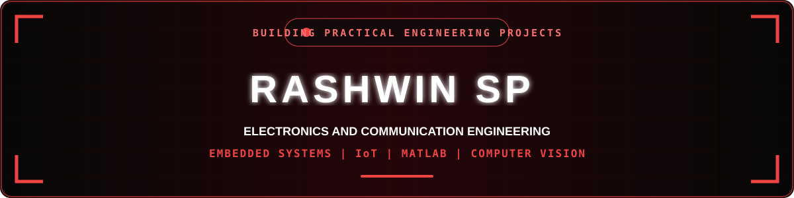

  

  

 

  
  &nbsp;&nbsp;
  
  &nbsp;&nbsp;
  
  &nbsp;&nbsp;
  

  

  

<h1 align="center">ABOUT ME</h1>

  

  

I am currently pursuing my <b>Bachelor of Engineering in Electronics and Communication Engineering</b>
at <b>Dr. N.G.P. Institute of Technology, Coimbatore</b>, with a CGPA of <b>7.40</b>.
My interests span both core electronics and information technology, especially Embedded Systems,
IoT, MATLAB, Java, Computer Vision and Software Development.

I enjoy applying engineering concepts through practical projects involving sensors,
microcontrollers, robotics, automation and computer vision. My practical training at
<b>KrishTec Technologies</b> and <b>Coimbatore Institute of Technology</b>
has also provided exposure to embedded development, communication systems, FPGA technology and antenna design.

My career goal is to combine my electronics foundation with programming and software technologies
to develop reliable, intelligent and useful engineering solutions.

 

  
  &nbsp;&nbsp;
  
  &nbsp;&nbsp;
  

  

<h1 align="center">FEATURED PROJECT SPOTLIGHT</h1>

<h2 align="center">UAV Vision-Based Mapping Using MATLAB</h2>

This project develops a computer vision-based mapping system for processing aerial images captured
using UAVs. MATLAB is used for feature extraction, feature matching, image alignment and stitching
to convert multiple aerial frames into a wider terrain representation.

The project is designed for applications such as surveying and environmental monitoring
and has provided practical experience with MATLAB, image processing and computer vision algorithms.

<b>Feature Extraction</b>, Feature Matching, Image Alignment, Image Stitching, Terrain Mapping

 

  

<h1 align="center">PROJECTS</h1>

<h2 align="center">Fire Fighting Robot</h2>

An autonomous embedded robot developed using a microcontroller, flame sensor,
temperature sensor and motor-control hardware. The system detects fire-related
conditions and controls robot movement automatically.

<b>Embedded C</b>, Fire Detection, Temperature Sensing, Motor Control, Relay Control

 

<h2 align="center">Waste Segregation Machine</h2>

An Arduino-based automated system developed to classify waste into dry,
wet and metallic categories. Multiple sensors provide input to the Arduino,
which controls a servo-based sorting mechanism.

<b>Arduino</b>, Sensor Interfacing, Waste Classification, Servo Control, Automation

 

<h2 align="center">AI Autonomous Robot Simulation</h2>

A software-based robotics project combining YOLO and OpenCV for real-time object detection.
The system analyses webcam input and generates movement decisions such as forward movement,
stopping or changing direction according to the detected objects.

<b>YOLO Object Detection</b>, OpenCV Video Processing, Obstacle Recognition,
Movement Decision Logic, Virtual Robot Simulation

  

<h1 align="center">TECH STACK & SKILLS</h1>

 

<h2 align="center">Programming Languages</h2>

 

<h2 align="center">Engineering & Development Tools</h2>

 

<h2 align="center">Technical Areas</h2>

My technical interests combine embedded electronics with software development.
I use programming and engineering tools to explore practical hardware,
automation and computer-vision applications.

&nbsp;&nbsp;

&nbsp;&nbsp;

&nbsp;&nbsp;

&nbsp;&nbsp;

<b>Embedded Programming</b>, Sensor Interfacing, MATLAB Simulation,
Computer Vision, Java Programming, Git & GitHub

  

<h1 align="center">INTERNSHIP EXPERIENCE</h1>

<h2 align="center">KrishTec Technologies, Coimbatore</h2>

I completed a 15-day internship in IoT and Embedded Systems, gaining practical exposure
to microcontrollers, peripheral control and hardware-software integration.
I also developed a real-time scrolling display application during the training.

<b>IoT Fundamentals</b>, Embedded Programming, Peripheral Control,
Hardware Integration, Debugging

 

<h2 align="center">Coimbatore Institute of Technology</h2>

The training introduced practical concepts related to communication and electronics,
including 5G systems, modulation techniques, FPGA platforms, VLSI concepts and antenna design.

<b>5G Communication</b>, Modulation Techniques, FPGA Kits,
VLSI Fundamentals, Antenna Design

  

<h1 align="center">EDUCATION</h1>

<h2 align="center">2023 - Present</h2>

<h2 align="center">B.E. - Electronics & Communication Engineering</h2>

<h3 align="center">Dr. N.G.P. Institute of Technology, Coimbatore</h3>

<b>CGPA: 7.40</b>

<h3 align="center">Core Coursework</h3>

Microcontrollers & Embedded Systems,
Digital Signal Processing,
Antenna & Wave Propagation,
Linear Integrated Circuits,
Digital Communication,
Optical Fiber Communication,
Satellite Communication and
Digital Image Processing

My academic work combines electronics fundamentals with programming,
simulation and hardware-oriented projects while also strengthening
my software-development and problem-solving skills.

  

<h1 align="center">CERTIFICATIONS</h1>

<b>Explore Generative AI with Copilot in Bing</b> — Microsoft

<b>Hybrid Course on Water Quality Analysis</b> — NPTEL

<b>2D/3D CAD Modelling of Building Design</b> — Bentley

  

<h1 align="center">WORKSHOPS & PARTICIPATION</h1>

<b>VLSI Circuit Design and Verification</b> — PUMA Technovation India Pvt. Ltd.

<b>PCB Design and Layout</b> — Dr. N.G.P. Institute of Technology

<b>Drone Technologies</b> — Bannari Amman Institute of Technology

<b>Intercollege Short Film Competition</b>

  

<h1 align="center">GITHUB ANALYTICS</h1>

 

 

 

<h2 align="center">GitHub Streak</h2>

  

<h1 align="center">CONTRIBUTION JOURNEY</h1>

  

<h1 align="center">CURRENT FOCUS</h1>

My current focus is strengthening programming and problem-solving while continuing
to build practical knowledge in Embedded Systems, IoT, MATLAB and Computer Vision.

&nbsp;&nbsp;

&nbsp;&nbsp;

&nbsp;&nbsp;

&nbsp;&nbsp;

<b>Java & DSA</b>, Problem Solving, Embedded Development,
IoT Applications, Computer Vision

  

<h1 align="center">LET'S CONNECT & COLLABORATE</h1>

Open to internships, technical discussions and engineering projects related to
Embedded Systems, IoT, Software Development, Robotics and Computer Vision.

 

&nbsp;&nbsp;&nbsp;&nbsp;&nbsp;&nbsp;

&nbsp;&nbsp;&nbsp;&nbsp;&nbsp;&nbsp;

 

&nbsp;&nbsp;

&nbsp;&nbsp;

  

